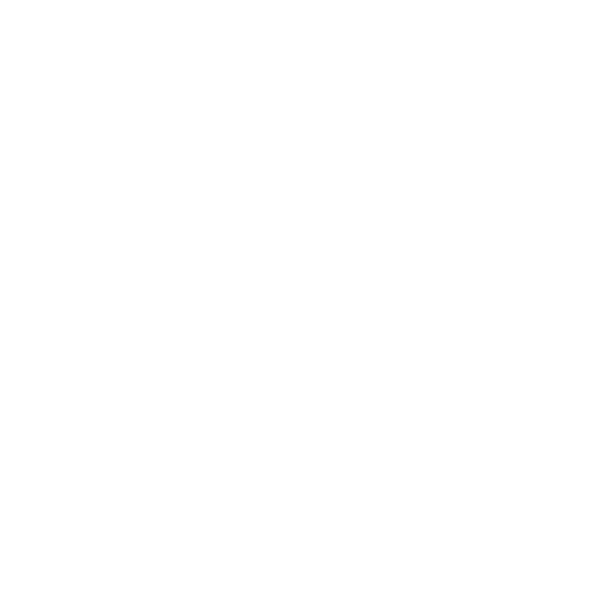
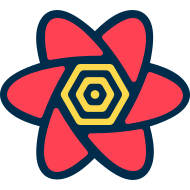

# Hi 👋, I'm Rohit

<h3>Graduate Computer Science Student at SIUE &bull; Software Engineer &bull; Full-Stack & AI Systems</h3>

Graduate Computer Science student and Teaching Assistant at <b>Southern Illinois University Edwardsville</b>, and Software Engineer at <b>Technimus</b>. Focused on building high-performance, multi-tenant scalable backends, responsive full-stack applications, and researching LLM fine-tuning & AI integration.

Check out my <a href="https://sahrohit.com.np"><b>Portfolio (sahrohit.com.np)</b></a> &bull; <a href="https://sahrohit.netlify.app"><b>Blog (sahrohit.netlify.app)</b></a> &bull; <a href="./resume.pdf"><b>Resume</b></a>

    
    
    
    
    

---

### 🛠️ Languages and Technologies

#### Languages

    
    
    
    
    
    
    
    

#### Frontend & Full-Stack Development

    
    
    
    
    
    

#### Backend, Databases & Streams

    
    
    
    
    
    
    
    

#### Cloud, DevOps & Tools

    
    
    
    
    
    
    

#### AI, Machine Learning & Data Science

    
    
    
    
    
    

---

### 🔭 What I am Learning & Exploring

    
    
    
    
    

