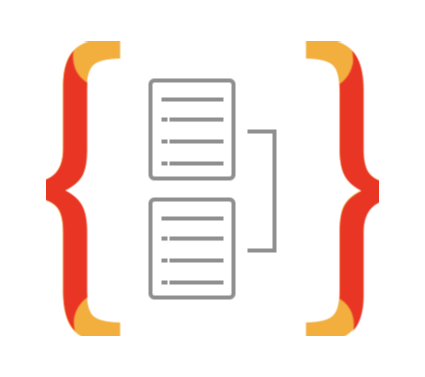

<h1>Hi 👋, I'm Rohit </h1>

<h3>A passionate fullstack developer from Nepal</h3>

 

    
    
    
    
    
    

<h3>Languages and Tools</h3>

<h4>Frontend Centric</h4>

    
         
     
    
     
    
        
    
    
    
     
    
    

<h4>Backend Centric</h4>

      
    
        
      
    

<h4>Database & Streams</h4>

    
          
     
    
    
        
    

<h4>CI/CD Centric</h4>

    
        

<h4>Miscellaneous & Productivity Boost</h4>

    
    
    
    
    
    
    
     
       

<!-- <h3>Language and Tools</h3>

    
    
    
    
    
    
    
    
    
    
    
    
     
    
    
    
    
    
    
    
    
    
    
    
    
    
    
    
    
    
    
    
    
    
    

 -->

<h3>What I am learning ?</h3>

    
    
    
         
           

 
<h3>Github Statistics:</h3>
<!-- 

      

 -->

<table>
  <tr>
    <td>
      
    </td>
    <td>
      
    </td>
  </tr>
  <!-- <tr>
  <td colspan="2">
  
  </td>
  </tr> -->
</table>

<h3> : Github Visits : </h3>

